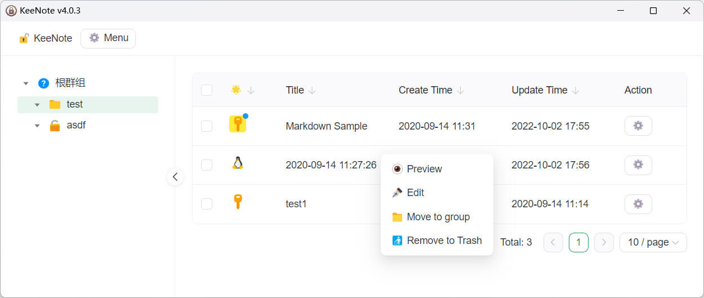
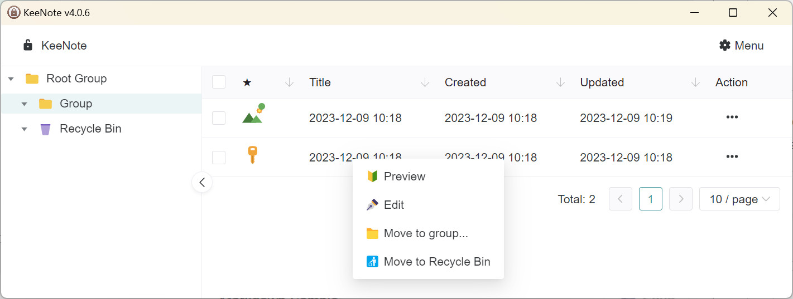

# KeeNote V4

A secure note-editing web & desktop client, powered by KeePass (kdbxweb) + Nest.js + Vue 3 (NaiveUI)




## Directory Structure

- `electron` App based backend, front end communicates with IPC
- `nest` Web-based backend, front-end communicates via HTTP (supports encryption)
- `vue` Frontend folder, automatically adapt backend (Election or Nest)

## Quick Start Development

1. Start frontend development

```sh
cd vue
yarn
yarn dev
```

2. Start backend(nest) development

```sh
cd nest
yarn
yarn dev
```

3. Open http://127.0.0.1:3030/ ([Config](./vue/vite.config.ts))

---

## Build for production

### Build Frontend (First)

```sh
cd vue
yarn
yarn build
```

### Build Nest

See [README](./nest/README.md)

### Build Electron (Optional)

```sh
cd electron
yarn
yarn build
```
