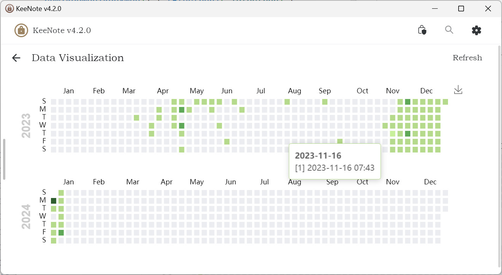
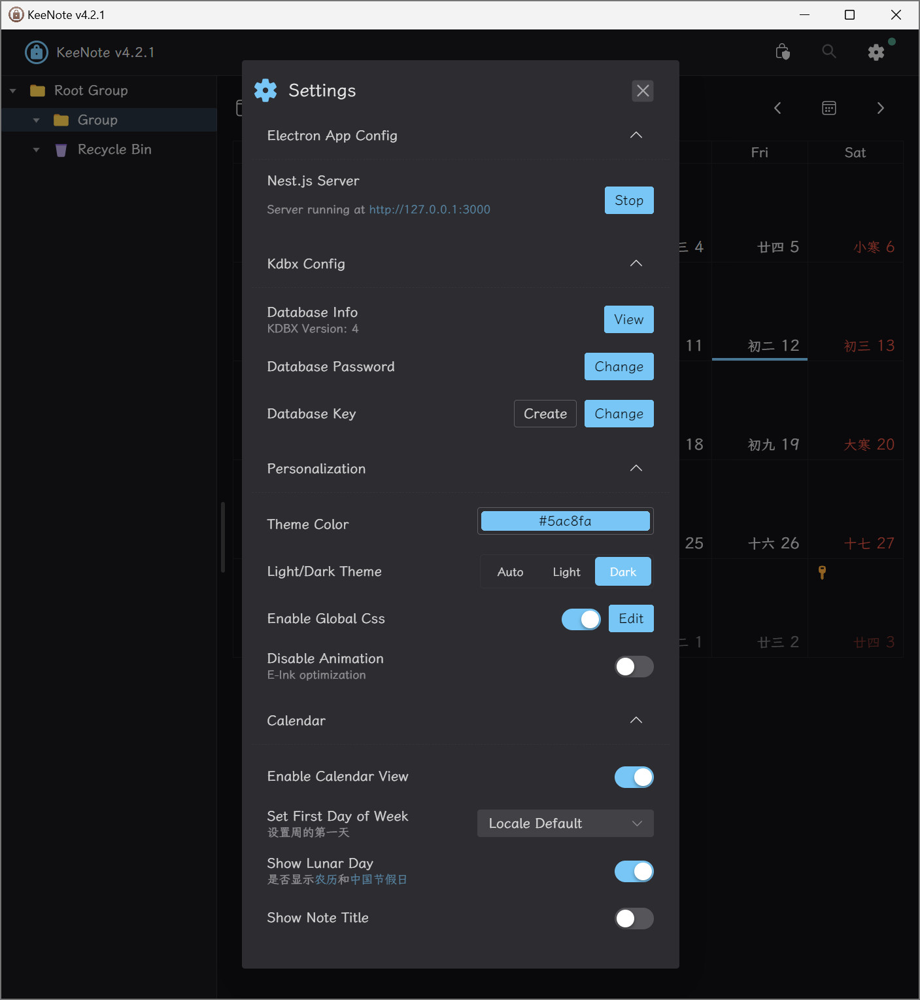
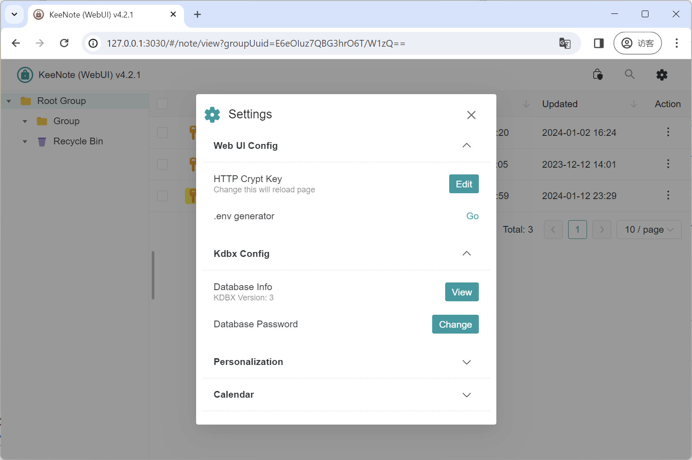

# KeeNote

- 安全的本地笔记App (Electron App + Web UI)
- 技术栈： KeePass ([kdbxweb](https://github.com/keeweb/kdbxweb)) + [Electron](./electron) + [Nest.js](./electron/src/nest) + [Vue](./vue) 3 (NaiveUI)

---

- A secure note-editing app (Electron Desktop App + Web UI)
- Powered by KeePass ([kdbxweb](https://github.com/keeweb/kdbxweb)) + [Electron](./electron) + [Nest.js](./electron/src/nest) + [Vue](./vue) 3 (NaiveUI)

## Screenshot

Open a kdbx database:


Tree view + list view (dark mode):


Calendar view:


Editing view (HyperMD):


Data Visualization (echarts):



Full customizable settings:



Running in browser (safe & secure):



## Feats · 功能

- [x] 支持 KeePass KDBX4 数据库格式
- [x] 支持 Nest.js 启动网页服务器（内置于 Electron 客户端）
  - [x] HTTP 请求体加密
  - [x] 服务器 `.env` 配置文件生成器
- [x] Kdbx 数据库控制
  - [x] 创建数据库
  - [x] 修改数据库密码/密钥
  - [x] 基本信息编辑，支持修改创建时间
  - [x] HyperMD 高级 Markdown 文本编辑器
  - [x] 使用 Notes 字段存储笔记
  - [x] 支持附件
- [x] 列表视图
  - [x] 导入/导出 Entry 为 json 文件
- [x] 日历视图
  - [x] 显示农历、节假日
  - [x] 类似 Github 热力图可视化统计
- [x] 丰富的自定义设置选项
  - [x] 个性化主题颜色
  - [x] 动态自定义CSS
  - [x] 墨水屏优化（关闭动画）

## Directory Structure

- `electron` App based backend, front end communicates with IPC
- `electron/src/nest` Web-based backend, front-end communicates via HTTP (supports encryption)
- `vue` Frontend folder, automatically adapt backend (Election or Nest)

## Development

1.Start frontend development

```sh
cd vue
yarn
yarn dev
```

2.Start backend(electron+nest) development

```sh
cd electron
yarn
yarn watch-src
yarn dev
```

2.1 Start nest-only development (optional)

```sh
cd electron
yarn
yarn watch-nest
yarn dev-nest
```

2.2 For web UI, visit: http://127.0.0.1:3030/ ([Config](./vue/vite.config.ts))

---

## Build for production

### Build Frontend (First)

```sh
cd vue
yarn
yarn build
```

### Build Electron

```sh
cd electron
yarn
yarn build
```
